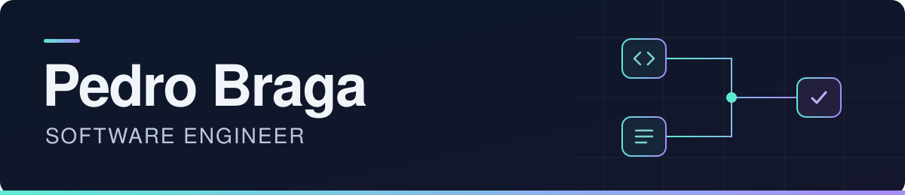

  

  <strong>Aplicações web, integrações e automações para operações reais.</strong> 
  Full-stack · E-commerce · Backend · APIs

  <a href="https://pedrobragabes.com">Portfólio</a> ·
  <a href="https://www.linkedin.com/in/pedrobragabes/">LinkedIn</a> ·
  <a href="mailto:pedrobraga855@gmail.com">E-mail</a> ·
  <a href="#projetos-em-destaque">Projetos</a>

## Sobre mim

Sou Software Engineer na **AquaFlora AgroShop**, fundador da **BragaCode** e estudante de **Engenharia de Computação na UNIVESP**. Desenvolvo aplicações, integrações e automações que conectam operações reais ao ambiente digital — de sistemas legados e estoque a e-commerce, APIs, painéis e aplicações internas.

Trabalho principalmente com **TypeScript, React/Next.js, Node.js e Python**, com atenção à integridade de dados, autenticação, testes, observabilidade e manutenção.

## Projetos em destaque

### [AquaFlora Stock Sync](https://github.com/pedrobragabes/aquaflora-stock-sync)
**Status: uso operacional**

**Integração entre ERP legado e WooCommerce.** Sincroniza preços e estoque do Athos com a loja virtual, preservando o conteúdo do catálogo.

- Modo LITE restrito a produtos existentes, simulação antes da execução e proteção de edições manuais.
- Automação no Windows, registros de execução e tratamento de dados de catálogo.

`Python` `WooCommerce REST API` `SQLite` `PowerShell`

### Commerce Agent
**Status: em desenvolvimento · Repositório privado**

**Motor de comércio conversacional para WhatsApp Business.** Arquitetura que separa o canal de mensagens, o catálogo e a orquestração de IA, com integração planejada à API oficial da Meta.

- Webhooks, filas por conversa, idempotência e transferência para atendimento humano.
- Respostas sobre produtos condicionadas a dados de catálogo; a LLM não é fonte de preço ou estoque. Integrações externas e piloto ainda em validação, sem operação em produção.

`TypeScript` `Node.js` `PostgreSQL` `Redis` `BullMQ` `APIs` `LLMs`

### [AquaTV](https://github.com/pedrobragabes/AquaFloraTV)
**Status: MVP instalado · Validação operacional**

**Gestão de conteúdo para as TVs da loja.** Reúne dashboard, API e aplicativo Android TV para organizar mídias, playlists e programação na rede local.

- Player com cache e reprodução offline, monitoramento de dispositivos e recuperação de falhas.
- MVP instalado em dispositivo físico, com validações operacionais de go-live em andamento.

`TypeScript` `Next.js` `Express` `Prisma` `SQLite` `React Native / Expo`

### [JoystickNights](https://github.com/pedrobragabes/JoysticKnights)
**Status: ativo · Evolução do frontend headless**

**Plataforma editorial própria sobre games.** Portal que criei e mantenho desde 2020, conectando desenvolvimento web e produção de conteúdo.

- Frontend em Next.js integrado ao WordPress como CMS headless.
- Experiência com publicação editorial, customizações e evolução da arquitetura do portal.

`TypeScript` `Next.js` `React` `Tailwind CSS` `WordPress`

## Atividade no GitHub

  
  

Cartões gerados por serviços externos; os números podem variar conforme a cobertura e a atualização de cada serviço.

## Tecnologias e prática

| Área | Tecnologias |
| --- | --- |
| Interfaces | React, Next.js, TypeScript, JavaScript, Tailwind CSS |
| Backend e integrações | Node.js, Express, Python, APIs REST, WordPress e WooCommerce |
| Dados | PostgreSQL, SQLite, MySQL, Redis, Prisma e Supabase |
| Engenharia e entrega | Git, GitHub Actions, Docker, Vitest e Playwright |
| Infraestrutura e laboratório | Linux, Nginx, Proxmox e Cloudflare Workers |

Na prática, me interesso por **contratos de API, consistência de estoque, controle de acesso, processamento idempotente e recuperação de falhas** — detalhes que fazem diferença quando o software passa a apoiar uma operação.

## Outros projetos e iniciativas

- **[BragaCode](https://github.com/pedrobragabes/BragaCode)** — desenvolvimento de software para pequenas empresas, com foco em aplicações web, integrações, automação e infraestrutura.
- **[Braga Commerce](https://github.com/pedrobragabes/Braga-Commerce)** · **Beta** — e-commerce para pequenos comércios, com Next.js, PostgreSQL, Supabase, reserva de estoque, Mercado Pago e painel administrativo. Acesso protegido durante a preparação para lançamento.
- **[Estudos UNIVESP](https://github.com/pedrobragabes/Estudos-UNIVESP)** — organizador acadêmico para disciplinas, atividades, notas e prazos, com Next.js e Cloudflare D1.
- **CadastraFácil** — produto próprio em desenvolvimento para simplificar o cadastro de produtos em pequenas empresas.
- **HomeLab** — ambiente de prática com virtualização, containers, redes, deploys, backups e monitoramento.

## Formação

**Bacharelado em Engenharia de Computação — UNIVESP** 
2025–2030 · Em andamento

**Idiomas:** português nativo · inglês avançado, nível C1 (EF SET).

## Contato

Aberto a projetos de desenvolvimento, integrações e oportunidades em Engenharia de Software.

**[Portfólio](https://pedrobragabes.com)** · **[LinkedIn](https://www.linkedin.com/in/pedrobragabes/)** · **[pedrobraga855@gmail.com](mailto:pedrobraga855@gmail.com)**
